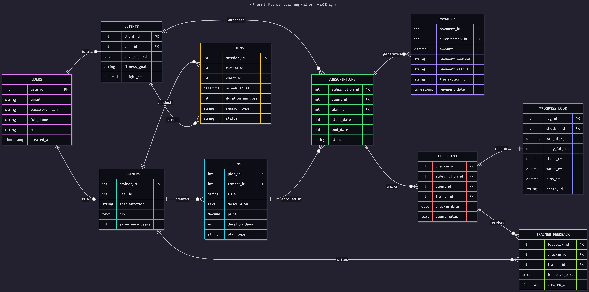

# Fitness Influencer Coaching Platform – ER Diagram

## Overview

This project models a database design for a fitness influencer who has transitioned from informal coaching (Instagram DMs and video calls) to a structured online coaching platform.

The system is designed to support:
- Client onboarding and management  
- Selling structured fitness plans  
- Scheduling consultations and sessions  
- Managing subscriptions and payments  
- Tracking client progress and check-ins  

---

## ER Diagram

---

## Live Diagram (Mermaid)

View or edit the diagram here:  
https://mermaid.ai/d/01ba5da5-eb49-45a3-bff4-5a1d2ef0c5af

---

## Core Concept

The platform follows a **subscription-based coaching model**:

- Trainers create coaching plans  
- Clients purchase plans through subscriptions  
- Sessions handle live interactions  
- Check-ins track ongoing progress  
- Payments manage transactions  

This structure reflects how modern online coaching systems operate.

---

## Key Entities

### Users
Stores common user data such as email, password, and role.

### Trainers & Clients
Derived from users:
- Trainers manage plans and provide coaching  
- Clients purchase plans and track their fitness journey  

---

### Plans
Represents coaching programs created by trainers.

Includes:
- Title and description  
- Pricing  
- Duration  
- Type (diet, workout, or combo)  

---

### Subscriptions
Central entity linking clients and plans.

Tracks:
- Plan start and end dates  
- Subscription status  
- Multiple plan purchases over time  

---

### Sessions
Represents live interactions such as:
- Consultations  
- Workout sessions  

---

### Check-ins & Progress Tracking
Allows clients to submit regular updates.

Includes:
- Weekly check-ins  
- Body measurements  
- Progress photos  

---

### Trainer Feedback
Stores trainer responses and guidance based on client check-ins.

---

### Payments
Handles financial transactions related to subscriptions.

Includes:
- Payment amount  
- Method and status  
- Transaction details  

---

## Design Highlights

- Role-based user structure (trainer/client)  
- Subscription-driven architecture  
- Clear separation between sessions and check-ins  
- Modular progress tracking system  
- Scalable and practical design  

---

## Conclusion

This ER diagram represents a real-world coaching platform design that balances simplicity with scalability.

The focus was on building a system that is both academically correct and practically usable in a production environment.