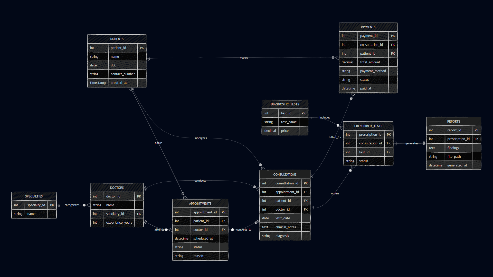

# Clinic Appointment and Diagnostics Platform – ER Diagram

## Overview

This project presents the database design for a clinic management system that handles appointments, consultations, diagnostic tests, reports, and payments.

The goal is to model a clean and scalable system that reflects how real clinics operate, without overcomplicating the design.

---

## ER Diagram

---

## Live Diagram (Mermaid)

View or edit the diagram here:  
https://mermaid.ai/play?utm_source=ai_live_editor&utm_medium=share#pako:eNqtVk1v4jAQ_SuWpb3RKiDahkh7oBRWqBQQZA-7QorceApWEztynG4p9L-vk5AQnED3sD4lnq83M28m2WFfUMAOBvnAyFqScMWRPpRJ8BUTHE0WK57fffuGBkICWkBAUlG8YVGci-Z9dzycuku0319diR3qz-ez8dR9yu4c9CzE60HzYTZwZ4tzikQp4PSgupwPB-P-RHsu1QtrB_lEwVpI9gFxBV8_igTjKgSukBIaLo-TQGVoc52TeHuhne7RYDZd_py4OgX9kLoW_A2kij0lmrMzDRJOQa4FNKfY4J4mvqrCTkvPRayYH6NRIP7kglPDg7f5YrgcLMb3wwfPHS6zogmpwxexx_0f09nSHQ8O4vNmjPtBQgvQNYXUcL9Hi-F8tsj018BB6qpXgc_JNq11fAlw_1dJAxYEQL0XIZvrWlENyWseqAz1vekgt38_0fRoFBbGZZhd_p4eTRIUaV5o8B6jaP54FMVKMr5GnIRwvKQ6cUTFc01Nd1MRX3k8CZ9BHsWKhRArEkbIl6CNqUdULv0scBU8MWBR4Ssh_wlVqh5H4DMSqG1qMXo8FcJ7BFIn6YO3BVKQpERQnbDdBbcXgZTeTmbLcEeOg2k6NFphpnAsR1WS9iMtMYr9DdAkqNS3AlI3QCVx7Vo3JC4WQon-lLwGfL-ySJrwG-mN_kd66I3FTHnpY4VW8K7RBIwznwQeFwrq6dF8mzCz27XdYCSpfZ0bhkxkTITmR0gCFEnmm0yoLRNz8iTEvmTRuXKa5TaLViAdPV5seYmnWGIGDAmRkM18NABWA2UteGGc6nD14r-wADzd700DV4sN2rALytVX21HbczPzVZHOkK7omxJKM4iEIuH1wSnChqA2gn45V2WGEWGV5HALryWj2FEygRYOQYYkfcVZkiusNqAZhR39SIl8XeEVT20iwn8LERZmUiTrTfGSRGmsw69KqQHpB3iQZoKddq-TucDODr9j57Z7bd_dWFbHumt37Y7VbeEtdrq9665l3dqW3bM7N72O_dnCH1lMK1fXp9dtt227fdPCQJme0af8Ryn7X_r8CxP0zDQ

---

## System Flow

The system follows a structured flow:

Patient → Appointment → Consultation → Diagnostic Tests → Reports → Payment

Key idea:
- Appointment represents booking intent  
- Consultation represents the actual visit  
- Tests are prescribed during consultation  
- Reports are generated after tests  
- Payments are linked to consultations  

---

## Key Entities

### Patients
Stores basic patient information and allows multiple visits over time.

### Doctors & Specialties
Doctors are associated with specialties, allowing categorization and filtering.

### Appointments
Represents scheduled visits with status tracking (booked, cancelled, completed).

### Consultations
Represents the actual doctor visit and stores diagnosis and notes.

### Diagnostic Tests
Master table for all available tests.

### Prescribed Tests
Links consultations with tests, allowing multiple tests per visit.

### Reports
Stores results generated after diagnostic tests.

### Payments
Handles billing for consultations and supports real-world payment scenarios.

---

## Design Highlights

- Clear separation between appointment and consultation  
- Supports multiple visits per patient  
- Allows multiple tests per consultation  
- Reports linked to specific prescribed tests  
- Payment system designed for real-world usage  
- Specialty normalized instead of using plain text  

---

## Practical Considerations

- The design avoids overcomplication while remaining scalable  
- Supports real clinic workflows  
- Can be extended with features like billing breakdown, lab integration, or notifications  

---

## Conclusion

This ER diagram reflects a practical clinic system design focused on clarity, scalability, and real-world applicability.

The focus was on understanding the workflow and modeling relationships correctly rather than just defining tables.