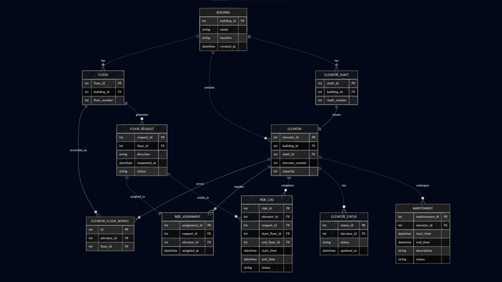

# 🚀 Smart Elevator Control System – ER Diagram

## 📌 Overview

This project models a Smart Elevator Control Platform used in large-scale infrastructure such as corporate buildings, malls, airports, hospitals, and high-rise residential complexes.

The system is designed to handle:
- Multiple buildings
- Multiple elevators per building
- Floor-level request tracking
- Elevator assignment
- Ride logging and analytics
- Maintenance and status monitoring

The goal of this ERD is to design a scalable and production-ready database system that separates static configuration from real-time operational data.

---

## 🧠 Design Approach

The design follows key backend engineering principles:

- Separation of static data (Building, Floor, Elevator)
- From dynamic data (Requests, Assignments, Rides, Status, Maintenance)

This ensures:
- Better scalability
- Cleaner data management
- Real-world system compatibility

---

## 🏗️ Core Entities

### Building
Represents each infrastructure unit connected to the platform.

### Floor
Each building contains multiple floors.

### Elevator Shaft (Optional but recommended)
Represents the physical shaft in which an elevator operates.

### Elevator
Each elevator belongs to a building and optionally a shaft.

### ElevatorFloorService (Junction Table)
Handles many-to-many relationship between elevators and floors:
- One elevator serves multiple floors
- One floor can be served by multiple elevators

---

## ⚙️ Operational Entities

### FloorRequest
Represents a user-generated request from a floor (UP/DOWN).

### RideAssignment
Maps a request to an elevator.
- Keeps request generation separate from allocation logic

### RideLog
Stores completed rides for:
- Analytics
- Usage tracking
- Performance monitoring

---

## 🔄 Monitoring & Maintenance

### ElevatorStatus
Tracks real-time elevator state:
- IDLE
- MOVING
- MAINTENANCE

> Stored separately to avoid mixing with static elevator configuration.

### Maintenance
Stores maintenance history for each elevator.
- Ensures history is preserved instead of overwritten

---

## 🔗 Relationships

- One Building has many Floors (1:N)  
- One Building has many Elevators (1:N)  
- One Building has many Shafts (1:N)  

- One Shaft contains one Elevator (1:1)  

- One Elevator serves many Floors and one Floor can be served by many Elevators (M:N via ElevatorFloorService)  

- One Floor generates many Requests (1:N)  

- One Request is assigned to one Elevator (1:1 via RideAssignment)  

- One Elevator handles many Assignments (1:N)  

- One Elevator completes many Rides (1:N)  

- One Elevator has many Status updates (1:N)  

- One Elevator has many Maintenance records (1:N)  

> Many-to-many relationships are resolved using junction tables to ensure scalability and query efficiency.

---

## 📊 Key Features Supported

This design allows the system to answer:

- How many buildings are connected?
- How many elevators exist per building?
- Which floors belong to which building?
- Which elevator serves which floors?
- Which requests are pending or completed?
- Which elevator handled the most rides?
- How many rides were completed today?
- Is an elevator under maintenance?
- Historical ride analytics and performance tracking

---

## 🖼️ ER Diagram

The ER diagram is included in this repository:

---

## 🔗 Live Diagram

View and edit the ER diagram here:

https://mermaid.ai/play?utm_source=ai_live_editor&utm_medium=share#pako:eNqlVt9v2jAQ_lciS32jVcugJXljbehQKWxA-zAhRSa-JtYSm9lOtRb432eSEPLDpUPLQxTnfHff3fn7kjXyOQHkIBB3FAcCxwu2YJa-vj4NR3fD8b21zta7izJlLRMaEcoCjxLr-8PBJpXQby2GY2i8jLiPFeXsYCBYgaIxWL4A_Ug8rDLjdp9_MJpMpvXkLxHnop65jmrwYHJiSbwEUUvijtzn_nwy9Wbf-oN5PZsM8Ys6NVvmdDRbPQ9E8IrV6YUV-OqGImAZxt7o4xX2qXr7qBVp472ZO30e3rp1qAaEZfTm1pcM1fF6U_fHkztrNF7A7wSksfWNiKVjRqgA_4NzlocsnbSSo1RYJbKGcDq8c73-bDa8Hz-64wZGLCUNWAzMCLNUweAf-1VAzSKbOJFCGk0anBSUgHfiaI4g1O0QyjN2Oo3KiNlYVJAF2D0ajDv3qunYFA4MnffnT7MGRVOfU2o3JKvAS1bELEiP_eF47o774yYrYqzvwDDzTxrDf_aLgPQFXVUP_LFenp1ZU4hSJZYhXcmG1G825-d8nUuvY4VYmjcUQuZYPmdKV__Jxlxf85BG7d15bDbl0CFPJDS2N0JX9cqxJIhXkOWPyGce2PdBc24Zgbd8q35_yh0p1MqxAmAg9ICkWc7yWuoK4hyorbi5qqZLiBmJPm5DIQm7UcSrCFSl9gqk6nYBMomU5g77tMU594zj228u08OxEkZABBwkaqFAyxNylEighWIQmix6iVIKLZAKQR9t5OhHgsWvBVqwrfZZYfaT83jvJngShPtFxtD8d6XYAbuMtzxhCjndNABy1ugPcq569sWV3e1eX920v1y2291OC70hp3N90e7Ytt3rdOxO7_La3rbQe5ry8qJ3oyMAoZqzj9nvUfqXtP0LfCXHKg

---

## ⚠️ Key Design Decisions

- Ride data is not stored inside Elevator  
- Elevator status is tracked separately  
- Requests are decoupled from assignment logic  
- Maintenance history is preserved  
- Many-to-many relationships are handled using junction tables  

---

## ✅ Conclusion

This ERD represents a real-world scalable backend system for managing elevator operations across multiple buildings.

It ensures:
- Clean data separation
- Efficient querying
- Flexibility for future enhancements like AI-based elevator optimization

---

## 👨‍💻 Author

Developed as part of system design practice for real-world infrastructure platforms.