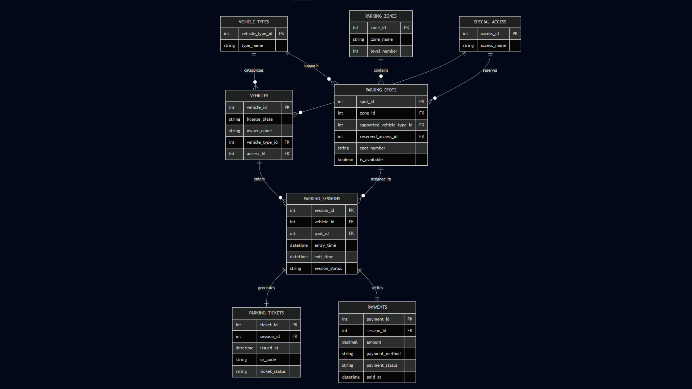

# 🚗 Comic-Con Parking System – ER Diagram

This project represents the database design for a multi-zone parking management system designed for a large Comic-Con event venue.

The system is designed to manage:

- vehicle entries and exits
- parking spot allocation
- reserved parking categories
- parking sessions
- payment tracking
- zone and level management

---

# 📌 Problem Overview

Comic-Con India attracts thousands of visitors across multiple event days.

Visitors arrive using:

- bikes
- cars
- SUVs
- EV vehicles
- cabs

The venue contains multiple parking zones and levels with reserved areas for:

- VIP guests
- exhibitors
- creators
- staff members
- cosplayers
- EV charging vehicles

The parking system must track:

- parking availability
- parking sessions
- assigned spots
- ticket generation
- payment records

---

# 🧠 Design Approach

The system is modeled around reusable parking sessions.

Key design decisions:

- one vehicle can visit multiple times
- one parking spot can serve multiple vehicles over time
- parking tickets are separated from parking sessions
- payments are linked to parking sessions
- reserved parking categories are modeled separately

---

# 🧱 Entities Included

- Vehicle_Types
- Special_Access
- Vehicles
- Parking_Zones
- Parking_Spots
- Parking_Sessions
- Parking_Tickets
- Payments

---

# 🔗 Relationships

- One vehicle type can belong to many vehicles
- One parking zone can contain many parking spots
- One vehicle can have multiple parking sessions
- One parking spot can be reused across multiple sessions
- One parking session generates one ticket
- One parking session has one payment record

---

# ⚙️ Important Design Decisions

## 1. Parking Sessions

A separate `Parking_Sessions` entity is used to track:

- entry time
- exit time
- assigned parking spot

This helps maintain parking history and supports multiple visits by the same vehicle.

---

## 2. Reserved Parking

Special categories like:

- VIP
- Staff
- Exhibitors
- Cosplayers

are handled using the `Special_Access` entity.

---

## 3. Spot Availability

Parking spots contain:

- supported vehicle type
- EV charging support
- availability status

This allows better parking allocation logic.

---

## 4. Ticket and Payment Separation

Parking tickets and payments are modeled separately because:

- tickets represent parking access
- payments represent financial transactions

This improves normalization and scalability.

---

# 📊 ER Diagram

The ER diagram is included in this repository:

## Mermaid Live Link

🔗 [View ER Diagram](https://mermaid.ai/live/edit#pako:eNqVVdtO4zAQ_RXLEm8FpaUtbd5QNuxWhbaiaCVQpcgkQ2qR2Fnb6dLbv69zJU1S0Pop8fHMOWc8tvfY5R5gE4P4QYkvSLhiSI-LC2QzRRUFiThDag3oHt5UBv62f02se9t5el7YS3Q4XF7yfTG5RCZyiQKfC7oDmQUsF7Y1ub13bi3LXrZFaGKm8sWlgAfqeQEgizMGrqKcyRP6Ms_i9nE6mf10ljr3ZD5L8gFTIPLlJbyYP30VQ6SkPgPPUbwm5JH6a4WW1IOyKKepX-azFjkpn64GZ4rQmvjT2tVDZBxFXKgvq1ePESBBbBJlpe47ykiA5rGKYlUvRuE7yXY4lPNPE2tqp_l8YCD0Rn4b-PxgzzLVoFTwKeDU6T6bTAZlCm1gTd0AHLWNwKEeWkw_cakEZT5KIUZCyJBjazFqaYnrgpRnEuZgI2XZT2c0tmcLqAtMghMFukgNlP_V1atQnfN9Nz1noECOba1WU7rj7JzMFGrqCGADgcPi8BVEK0_WVjUeGXFV56ny193kfazP1He-8-71nGYBKmZS_qroZLxyHgBhiEqHbAgNyGsA7ZaK1q270oT6dmkzVmmBhre8FtV5T7eCoiEk94_YOslnG_hBVQ0r_OVKpCIqlq0migNa86Co-w6te1Nx1yqVShkndVcNNX-EkzwOzYOZcbWKzC-DmrqIbENdkv-RBy4N9eVFQh6zprQiYQhqzb2zcFXiiemI0E_LR9zBvqAeNpWIoYNDECFJfnFqY4X166c3C5v60yPifYVXLImJCHvhPCzCBI_9NTbfSCD1XxwlZPmbWi4B5oGwEkvYvO6O0hzY3OMP_TvuXg27vd64O7juj43B9aCDt9jsD696A0OP_mg4HBrj7vDYwbuU1rga3aSQMe4ZN8Z41O9g8Kji4iF709On_fgPC3VnFQ)

---

# 🧾 Notes

- The design follows normalization principles
- Reusable parking spots are supported
- Multiple parking sessions per vehicle are supported
- Designed for scalability and real-world event usage

---

# 🚀 Conclusion

This ER diagram models a practical multi-zone event parking system capable of handling large-scale Comic-Con traffic efficiently.

The design focuses on:
- scalability
- clean relationships
- reusable parking infrastructure
- accurate session tracking

---

# 👨‍💻 Author

Built as part of a database design and ER modeling exercise.